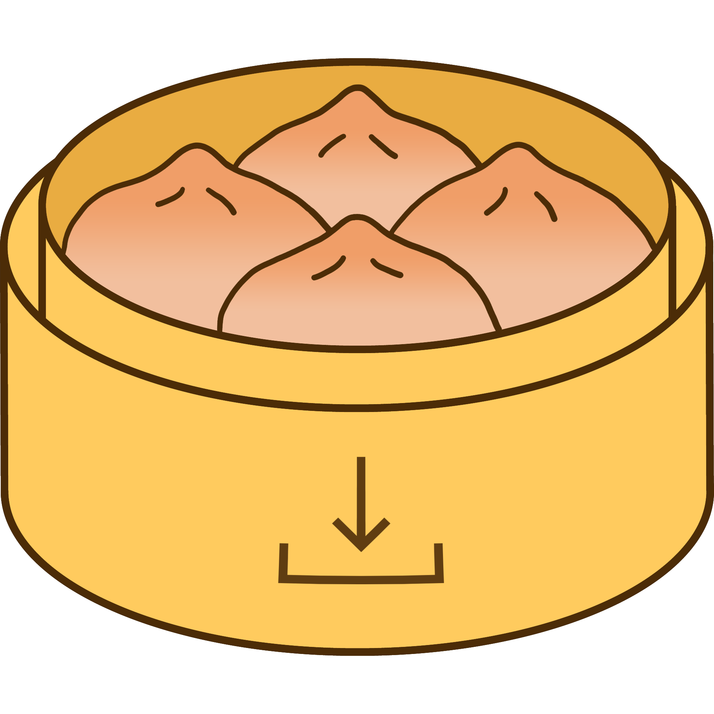

  

  <h3 align="center">Dumpling</h3>

  

    A simple, all-in-one Wii U file dumper! Developed with the intent of making dumping games and other files (for emulators like Cemu) faster and easier.
  

## How to install
**Method 1:**  
Use the Wii U App Store to download and install it in the homebrew launcher. See Dumpling's page [here](https://apps.fortheusers.org/wiiu/dumpling).

**Method 2:**  
Download the [latest release from Github](https://github.com/emiyl/dumpling/releases), and extract the `dumpling.zip` file to the root of your SD card.

## How to use
Using it just requires you to open up the homebrew launcher and launch the app. No Mocha or Haxchi required!

For an always up-to-date guide to dump your games for Cemu using Dumpling, see [cemu.cfw.guide](https://cemu.cfw.guide/dumping-games)! It also goes through the steps of installing and running homebrew and Dumpling for the first time!

## How to compile
- Install [DevkitPro](https://devkitpro.org/wiki/Getting_Started) for your platform.
- Install [wut](https://github.com/devkitPro/wut) through DevkitPro's pacman or compile (and install) the latest source yourself.
- Compile [libiosuhax](https://github.com/wiiu-env/libiosuhax).
- Compile [libfat](https://github.com/Crementif/libfat) from source, since it has been fixed to perform MUCH better in certain situations which would normally cripple the classic Dumpling.
- Then, with all those dependencies installed, you can just run `make` to get the .rpx file that you can run on your Wii U.

## Features
- Dumps everything related to your games! Game, updates, DLC and saves are all dumped through one simple GUI!
- Dumps both disc and digital games in an extracted format, making for easy modding and usage with Cemu.
- Creates 1:1 copies of data with proper meta data.
- Allows dumping to an SD or USB stick/drive (must be formatted as fat32).
- Allows you to dump system applications too.
- Feature to quickly dump everything needed to play online with Cemu, including the otp.bin and seeprom.bin!
- Also dumps extra compatibility files for Cemu when dumping online files.
- Has features to dump the base game, update, DLC and save files separately.
- Now also supports easily dumping vWii games (requires [nfs2iso2nfs](https://github.com/FIX94/nfs2iso2nfs/releases/tag/v0.5.6) for converting vWii games to .iso).

## Credits
- [Crementif](https://github.com/Crementif) for [dumpling-rework](https://github.com/emiyl/dumpling)
- [emiyl](https://github.com/emiyl) for [dumpling-classic](https://github.com/emiyl/dumpling-classic)
- chrissie for testing
- [wut](https://github.com/devkitpro/wut) for providing the Wii U toolchain that Dumpling is built with
- FIX94, Maschell, Quarky, GaryOderNichts and koolkdev for making and maintaining homebrew (libraries)
- smea, plutoo, yellows8, naehrwert, derrek, dimok and kanye_west for making the exploits and CFW possible

## License
All the Dumpling code is [MIT Licensed](https://github.com/emiyl/dumpling/blob/master/LICENSE.md) except the [/source/stub](/source/stub) folder which uses wut's [GNU GPL v2.0 license](https://github.com/devkitPro/wut/blob/master/LICENSE.md).
Releases of Dumpling will never be created with this code included since it's only used for personal debugging builds.
